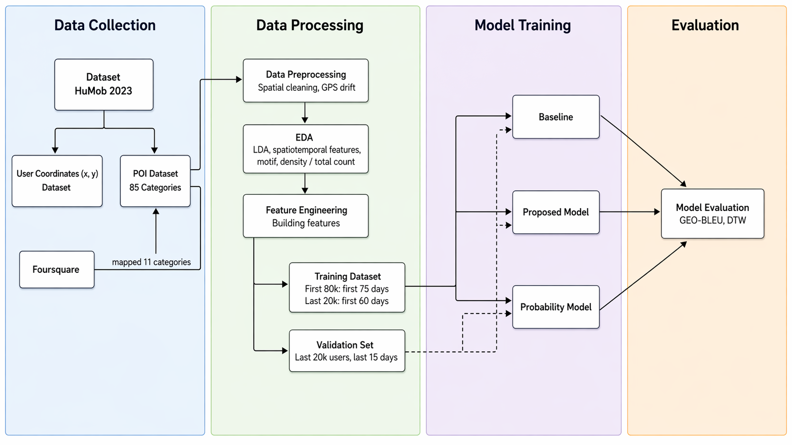

# Abstract

Accurate human mobility prediction is a complex societal challenge and is fundamental to the development of modern urban planning, public health, traffic management, and development of location-based services. This study investigates the impact of feature engineering and feature fusion strategies on trajectory prediction using the Human Mobility (HuMob) 2023 dataset. Building upon the LP(Location Prediction)-BERT baseline, trajectory predictions are formulated as a masked sequence imputation task, where missing segments of user trajectories were reconstructed using bidirectional context.

This study introduces three primary extensions to the LP-BERT baseline framework: spatial data cleaning to mitigate GPS drift, the incorporation of contextual and behavioural features, including temporal indicators, Points-of-Interest (POI) spatial representations, Latent Dirichlet Allocation (LDA)-derived functional zones, and mobility motif-based features, as well as an alternative concatenation-based feature fusion strategy. These extensions aim to provide a more enriched representation of user mobility patterns.

Experimental results demonstrate that spatial data cleaning yields the most significant improvement in performance, highlighting the importance of data quality in mobility modelling. Temporal features contributed the most consistent gains, while additional contextual and behavioural features provided limited or inconsistent improvements. Additionally, the comparison of fusion strategies indicated that concatenation-based fusion outperforms traditional additive embedding. 

Overall, the findings suggest that thorough data preprocessing and effective feature representation are more critical for predictive accuracy than increasing feature complexity. Ultimately, this study provides a systematic evaluation of feature contributions, offering practical insights for the design of mobility prediction models and highlights the importance of data quality in urban mobility spatiotemporal analysis

